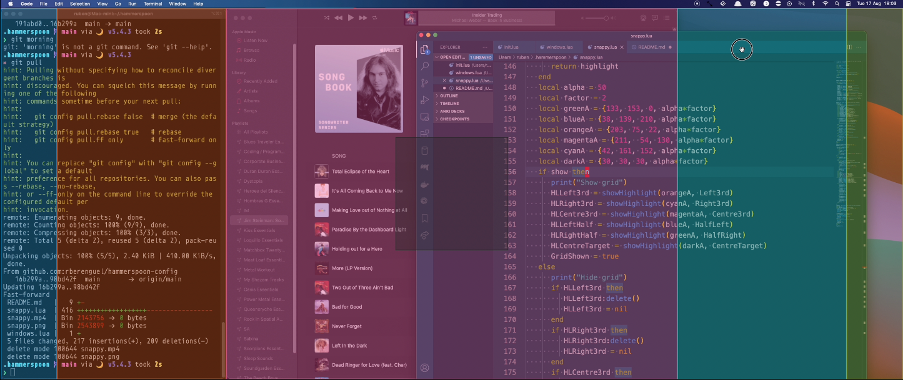

## Some hammerspoon configuration

I decided to stop using [Amethyst](https://ianyh.com/amethyst/) (even if I _love it_) because although automated
window layouts rock, the lack of overlapping windows in Amethyst makes using it problematic, particularly with only one screen. It forces you to use multiple desktops, and I'm not particularly a fan of this solution.

To mimic more or less my Amethyst usage, I borrowed the window management from [this post](https://medium.com/@jhkuperus/window-management-with-hammerspoon-personal-productivity-c77adc436888) (code available [here](https://github.com/jhkuperus/dotfiles/blob/master/hammerspoon/window-management.lua)) and the code from this [move-resize snippet](https://gist.github.com/kizzx2/e542fa74b80b7563045a) to implement a partial snap-to-grid:

- Start dragging a window, and press shift (briefly, it's modal). 
- A coloured overlay of the active zones will appear
- The outer sides convert the window in a half-pane
- The inner sides convert the window in 4/16ths of the screen (the overlayed area+the outer side) to either side
- The center converts the window in a 8/16ths of the screen pane in the center
- The center "target" maximises the window

